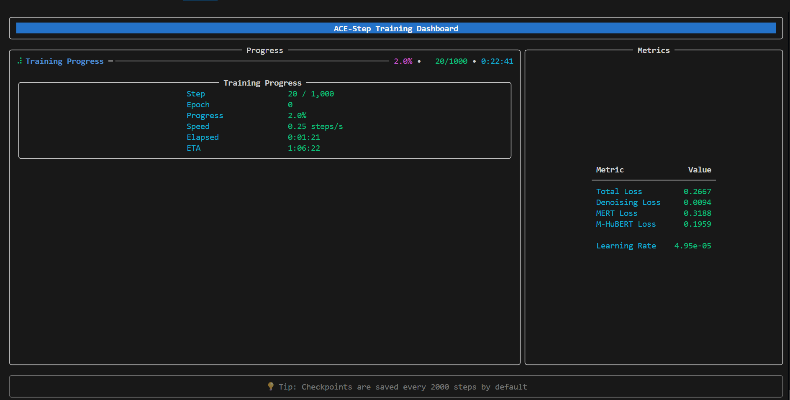

# ACE-Step Training CLI Guide

This guide explains how to use the new clean CLI interfaces for training ACE-Step models with LoRA adapters.



## Overview

We've separated the CLI interface from the training logic to provide a cleaner, more user-friendly experience. There are two CLI options available:

1. **Basic CLI** (`train_cli.py`) - Simple and clean interface
2. **Advanced Dashboard CLI** (`train_cli_advanced.py`) - Real-time training dashboard

## Basic CLI Usage

The basic CLI provides a clean command-line interface with organized help, validation, and progress tracking.

### Quick Start

```bash
python train_cli.py --dataset_path ./your_dataset --lora_config_path config/your_lora_config.json
```

Replace `./your_dataset` with your actual dataset path and `config/your_lora_config.json` with your LoRA configuration file.

### Features

- ✅ Clean, organized help menu with parameter groups
- ✅ Automatic validation of paths and settings
- ✅ Simple progress bar with key metrics
- ✅ Proper error handling and messages
- ✅ Detailed logs saved to `logs/` directory
- ✅ Configuration summary before training

### Example Output

```
┏━━━━━━━━━━━━━━━━━━━━━━━━━━━━━━━━━━━━━━━━━━━━━━━━━━━━━━━━━━━━━┓
┃                    ACE-Step Training                         ┃
┃━━━━━━━━━━━━━━━━━━━━━━━━━━━━━━━━━━━━━━━━━━━━━━━━━━━━━━━━━━━━┃
┃                Training Configuration                        ┃
┃ ┏━━━━━━━━━━━━━━━━━━━┳━━━━━━━━━━━━━━━━━━━━━━━━━━━━━━━━━━━┓ ┃
┃ ┃ Parameter         ┃ Value                             ┃ ┃
┃ ┡━━━━━━━━━━━━━━━━━━━╇━━━━━━━━━━━━━━━━━━━━━━━━━━━━━━━━━━━┩ ┃
┃ │ Dataset Path      │ ./zh_lora_dataset                 │ ┃
┃ │ LoRA Config       │ config/zh_rap_lora_config.json    │ ┃
┃ │ Learning Rate     │ 1.00e-04                          │ ┃
┃ │ Batch Size        │ 1                                 │ ┃
┃ │ Max Steps         │ 2,000,000                         │ ┃
┃ └───────────────────┴───────────────────────────────────┘ ┃
┗━━━━━━━━━━━━━━━━━━━━━━━━━━━━━━━━━━━━━━━━━━━━━━━━━━━━━━━━━━━━━┛

Starting training...

Step: 1000/2000000 (0.1%) | Loss: 0.4532 | Denoising: 0.3421 | LR: 1.00e-04
```

## Advanced Dashboard CLI Usage

The advanced CLI provides a real-time dashboard with live metrics and progress visualization.

### Quick Start

```bash
python train_cli_advanced.py --dataset_path ./your_dataset --lora_config_path config/your_lora_config.json
```

The advanced CLI will show a confirmation prompt with detailed configuration before starting training.

### Features

- 📊 Real-time training dashboard
- 📈 Live loss and metric visualization
- ⏱️ ETA and speed calculations
- 🎨 Beautiful, organized layout
- 💡 Helpful tips rotation
- 🔄 Auto-refresh display

### Dashboard Layout

```
╔═══════════════════════════════════════════════════════════╗
║           🎵 ACE-Step Training Dashboard 🎵               ║
╚═══════════════════════════════════════════════════════════╝

┏━━━━━━━━━━━━━━━━━━━━━━━━━━━━━━┳━━━━━━━━━━━━━━━━━━━━━━━━━┓
┃         Progress              ┃      Metrics             ┃
┃ ━━━━━━━━━━━━━━━━━━━━━━━━━━━━ ┃ ┏━━━━━━━━━━━━┳━━━━━━━━┓ ┃
┃ Training Progress  45.2%      ┃ ┃ Metric      │ Value  ┃ ┃
┃                               ┃ ┡━━━━━━━━━━━━━╇━━━━━━━━┩ ┃
┃ Step:     904,123/2,000,000   ┃ │ Total Loss  │ 0.4532 │ ┃
┃ Epoch:    12                  ┃ │ Denoising   │ 0.3421 │ ┃
┃ Speed:    1.45 steps/s        ┃ │ MERT Loss   │ 0.2134 │ ┃
┃ Elapsed:  6:23:45             ┃ │ Learning Rate│1.00e-04│ ┃
┃ ETA:      7:36:12             ┃ └─────────────┴────────┘ ┃
┗━━━━━━━━━━━━━━━━━━━━━━━━━━━━━━┻━━━━━━━━━━━━━━━━━━━━━━━━━┛

💡 Tip: Checkpoints are saved every 2000 steps by default
```

## Command-Line Arguments Reference

### Required Parameters

| Parameter | Description | Example |
|-----------|-------------|---------|
| `--dataset_path` | Path to your Huggingface format dataset | `./my_dataset` |
| `--lora_config_path` | Path to LoRA configuration JSON file | `config/my_lora.json` |

### Training Parameters

| Parameter | Default | Description |
|-----------|---------|-------------|
| `--learning_rate` | `1e-4` | Learning rate for optimization |
| `--batch_size` | `1` | Training batch size (increase if you have more VRAM) |
| `--max_steps` | `2000000` | Maximum training steps |
| `--epochs` | `-1` | Number of epochs (-1 for unlimited) |
| `--accumulate_grad_batches` | `1` | Gradient accumulation steps |
| `--gradient_clip_val` | `0.5` | Gradient clipping value |

### Model Parameters

| Parameter | Default | Description |
|-----------|---------|-------------|
| `--shift` | `3.0` | Flow matching shift parameter |
| `--precision` | `"32"` | Training precision (16, 32, or bf16) |

### Hardware Settings

| Parameter | Default | Description |
|-----------|---------|-------------|
| `--devices` | `1` | Number of GPUs to use |
| `--num_nodes` | `1` | Number of nodes for distributed training |
| `--num_workers` | `8` | Number of data loading workers |

### Experiment Settings

| Parameter | Default | Description |
|-----------|---------|-------------|
| `--exp_name` | `"chinese_rap_lora"` | Experiment name for logging |
| `--logger_dir` | `"./exps/logs/"` | Directory for logs and checkpoints |
| `--checkpoint_dir` | `None` | Directory for model checkpoints (auto-download if None) |
| `--ckpt_path` | `None` | Path to resume training from checkpoint |

### Logging and Validation

| Parameter | Default | Description |
|-----------|---------|-------------|
| `--every_n_train_steps` | `2000` | Save checkpoint every N steps |
| `--every_plot_step` | `2000` | Generate evaluation samples every N steps |
| `--val_check_interval` | `None` | Validation interval in steps |

### Display Options

| CLI Script | Parameter | Description |
|------------|-----------|-------------|
| `train_cli.py` | `--quiet` | Minimal output mode |
| `train_cli.py` | `--verbose` | Detailed debug output |
| `train_cli_advanced.py` | `--yes` or `-y` | Skip confirmation prompt |

## Usage Examples

### 1. Basic Training (Simple CLI)
```bash
python train_cli.py --dataset_path ./your_dataset --lora_config_path config/your_lora.json
```

### 2. Advanced Training (Dashboard CLI)
```bash
python train_cli_advanced.py --dataset_path ./your_dataset --lora_config_path config/your_lora.json
```

### 3. Custom Learning Rate and Batch Size
```bash
python train_cli.py --dataset_path ./your_dataset \
                    --lora_config_path config/your_lora.json \
                    --learning_rate 5e-5 \
                    --batch_size 2 \
                    --max_steps 100000
```

### 4. High Memory GPU Setup (RTX 4090/A100)
```bash
python train_cli.py --dataset_path ./your_dataset \
                    --lora_config_path config/your_lora.json \
                    --batch_size 4 \
                    --precision 16 \
                    --num_workers 12
```

### 5. Resume Training from Checkpoint
```bash
python train_cli.py --dataset_path ./your_dataset \
                    --lora_config_path config/your_lora.json \
                    --ckpt_path ./exps/logs/2024-01-01_12-00-00_my_experiment/checkpoints/epoch=10-step=50000.ckpt
```

### 6. Quick Start with Dashboard (Skip Confirmation)
```bash
python train_cli_advanced.py --dataset_path ./your_dataset \
                             --lora_config_path config/your_lora.json \
                             --yes
```

### 7. Quiet Mode (Minimal Output)
```bash
python train_cli.py --dataset_path ./your_dataset \
                    --lora_config_path config/your_lora.json \
                    --quiet
```

### 8. Custom Experiment with Full Configuration
```bash
python train_cli.py --dataset_path ./your_dataset \
                    --lora_config_path config/your_lora.json \
                    --exp_name "my_custom_model" \
                    --learning_rate 2e-4 \
                    --batch_size 2 \
                    --max_steps 150000 \
                    --every_n_train_steps 1000 \
                    --every_plot_step 5000 \
                    --logger_dir ./my_experiments/
```

### 9. Multi-GPU Training
```bash
python train_cli.py --dataset_path ./your_dataset \
                    --lora_config_path config/your_lora.json \
                    --devices 2 \
                    --batch_size 1 \
                    --accumulate_grad_batches 2
```

## Pro Tips & Best Practices

### 🚀 Getting Started
1. **Choose the Right CLI**: Use `train_cli.py` for simple training, `train_cli_advanced.py` for real-time monitoring
2. **Start Small**: Begin with default settings and adjust based on your hardware and needs
3. **Monitor Resources**: Keep an eye on GPU memory usage with `nvidia-smi -l 1` in another terminal

### 📊 Monitoring & Logging
4. **Training Logs**: All detailed logs are saved to `logs/` directory with timestamps
5. **TensorBoard**: Training metrics are logged to `./exps/logs/` for visualization
6. **Checkpoints**: Model checkpoints are saved to `./exps/logs/{timestamp}_{exp_name}/checkpoints/`
7. **Graceful Stop**: Press Ctrl+C to safely stop training and save current state

### ⚡ Performance Optimization
8. **Batch Size**: Increase `--batch_size` if you have more VRAM (2-4 for high-end GPUs)
9. **Mixed Precision**: Use `--precision 16` for faster training and lower memory usage
10. **Workers**: Increase `--num_workers` (8-16) for faster data loading on systems with good CPUs
11. **Gradient Accumulation**: Use `--accumulate_grad_batches` to simulate larger batch sizes

## Troubleshooting Common Issues

### 🚨 CUDA Out of Memory
```bash
# Solution 1: Reduce batch size
python train_cli.py --dataset_path ./your_dataset --lora_config_path config/your_lora.json --batch_size 1

# Solution 2: Use mixed precision
python train_cli.py --dataset_path ./your_dataset --lora_config_path config/your_lora.json --precision 16

# Solution 3: Use gradient accumulation instead of larger batch size
python train_cli.py --dataset_path ./your_dataset --lora_config_path config/your_lora.json --accumulate_grad_batches 4
```

### 📁 Dataset Not Found
- **Check Path**: Ensure `--dataset_path` points to an existing directory
- **Format**: Verify it's in Huggingface dataset format (with `data-*.arrow`, `dataset_info.json`, `state.json`)
- **Convert**: Use `convert2hf_dataset.py` if you need to convert your data

### 🐌 Training Too Slow
```bash
# Optimize data loading
python train_cli.py --dataset_path ./your_dataset --lora_config_path config/your_lora.json --num_workers 16

# Use mixed precision for speed
python train_cli.py --dataset_path ./your_dataset --lora_config_path config/your_lora.json --precision 16

# Check GPU utilization
nvidia-smi -l 1  # Run in separate terminal
```

### 🔧 Configuration Issues
- **LoRA Config**: Verify your LoRA config JSON file is valid and contains required fields
- **Model Not Found**: The first run will auto-download models (requires internet connection)
- **Permission Errors**: Ensure write permissions for log and checkpoint directories

### 💾 Checkpoint Issues
```bash
# Resume from specific checkpoint
python train_cli.py --dataset_path ./your_dataset \
                    --lora_config_path config/your_lora.json \
                    --ckpt_path ./exps/logs/your_experiment/checkpoints/epoch=5-step=10000.ckpt

# If checkpoint is corrupted, start fresh
python train_cli.py --dataset_path ./your_dataset --lora_config_path config/your_lora.json
```

## Quick Reference

### Help Commands
```bash
# Get detailed help for any CLI
python train_cli.py --help
python train_cli_advanced.py --help
```

### Most Common Command Patterns
```bash
# Basic training
python train_cli.py --dataset_path ./your_dataset --lora_config_path config/your_lora.json

# Training with optimizations
python train_cli.py --dataset_path ./your_dataset --lora_config_path config/your_lora.json --precision 16 --batch_size 2

# Advanced dashboard
python train_cli_advanced.py --dataset_path ./your_dataset --lora_config_path config/your_lora.json --yes

# Resume training
python train_cli.py --dataset_path ./your_dataset --lora_config_path config/your_lora.json --ckpt_path ./exps/logs/experiment/checkpoints/last.ckpt
```

## Old vs New Interface Comparison

### ❌ Old CLI (trainer.py) - Messy Output
```
2025-06-27 02:27:58.225 | INFO     | __main__:__init__:110 - Enabled gradients for LoRA parameter: transformer_blocks.0.attn.to_q.lora_A.chinese_rap_lora.weight
2025-06-27 02:27:58.225 | INFO     | __main__:__init__:110 - Enabled gradients for LoRA parameter: transformer_blocks.0.attn.to_q.lora_B.chinese_rap_lora.weight
[... hundreds of similar lines ...]
Epoch 0:  45%|████▌     | 450/1000 [01:23<01:42,  5.38it/s, v_num=2024, train/loss=0.432]
```

### ✅ New CLI (train_cli.py) - Clean Output
```
┏━━━━━━━━━━━━━━━━━━━━━━━━━━━━━━━━━━━━━━━━━━━━━━━━━━━━━━━━━━━━━┓
┃                    Training Configuration                    ┃
┗━━━━━━━━━━━━━━━━━━━━━━━━━━━━━━━━━━━━━━━━━━━━━━━━━━━━━━━━━━━━━┛

11:23:45 | INFO     | Enabled 420 LoRA parameters
11:23:45 | INFO     | Trainable parameters: 261,234,567 / 4,512,345,678 (5.79%)

Step: 1000/2000000 (0.1%) | Loss: 0.4532 | Denoising: 0.3421 | LR: 1.00e-04
```

### 🚀 Advanced CLI (train_cli_advanced.py) - Dashboard
```
╔═══════════════════════════════════════════════════════════╗
║           🎵 ACE-Step Training Dashboard 🎵               ║
╚═══════════════════════════════════════════════════════════╝

┏━━━━━━━━━━━━━━━━━━━━━━━━━━━━━━┳━━━━━━━━━━━━━━━━━━━━━━━━━┓
┃         Progress              ┃      Metrics             ┃
┃ Step:     1,234/2,000,000    ┃ Total Loss:    0.4532    ┃
┃ Progress: 6.2%               ┃ Denoising:     0.3421    ┃
┃ Speed:    1.45 steps/s       ┃ Learning Rate: 1.00e-04  ┃
┗━━━━━━━━━━━━━━━━━━━━━━━━━━━━━━┻━━━━━━━━━━━━━━━━━━━━━━━━━┛
```

---

**🎉 The new CLI interfaces provide a much cleaner, more professional training experience with better monitoring and control!** 